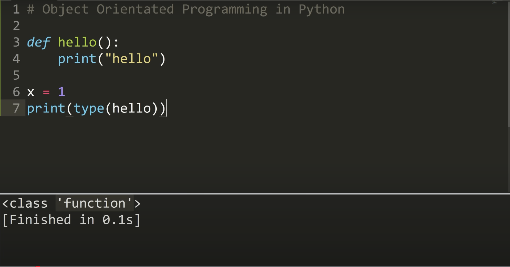
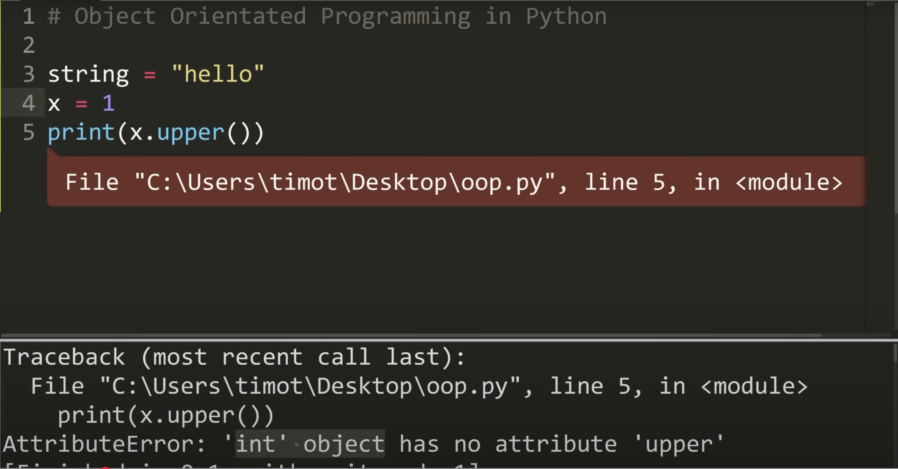
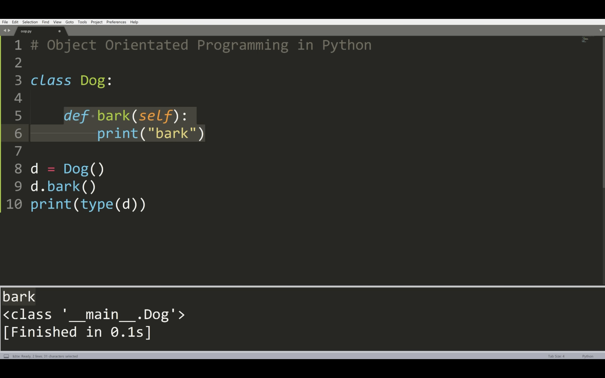
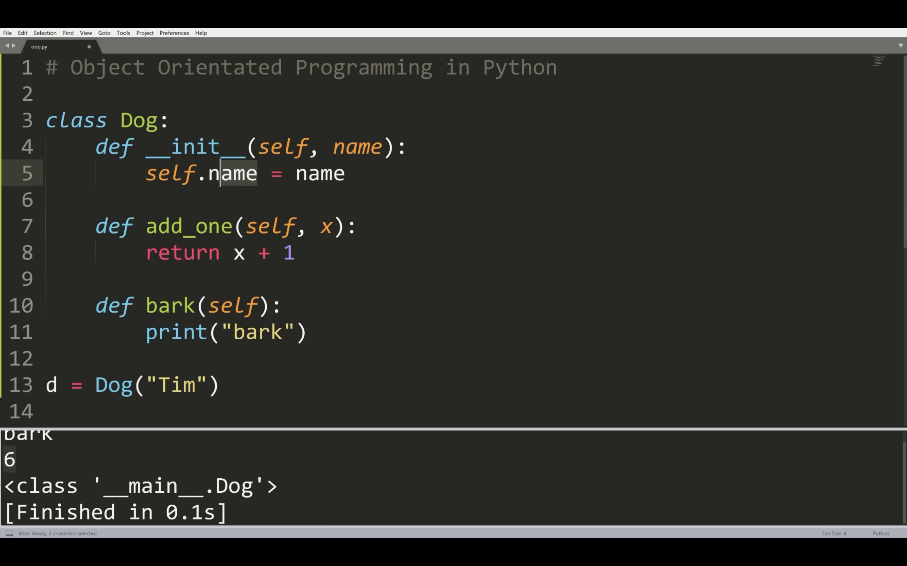
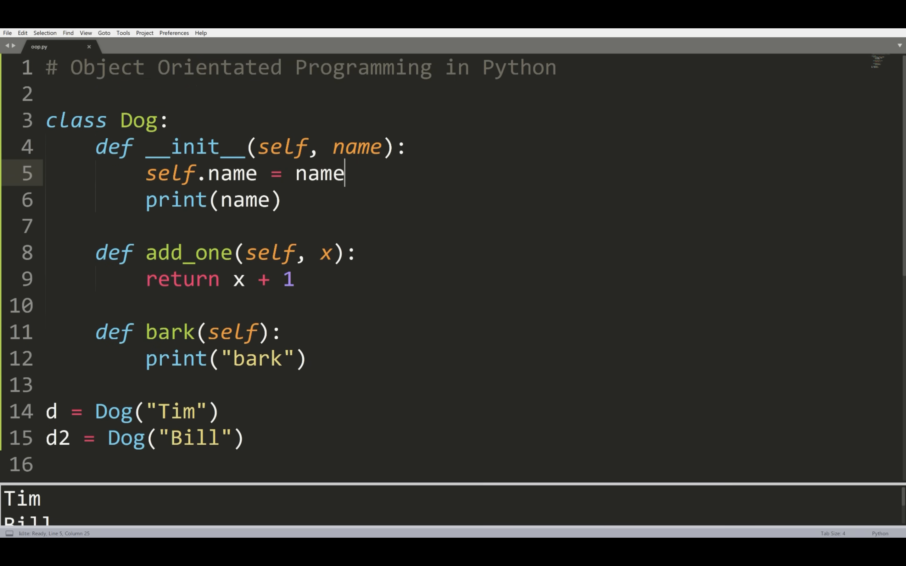
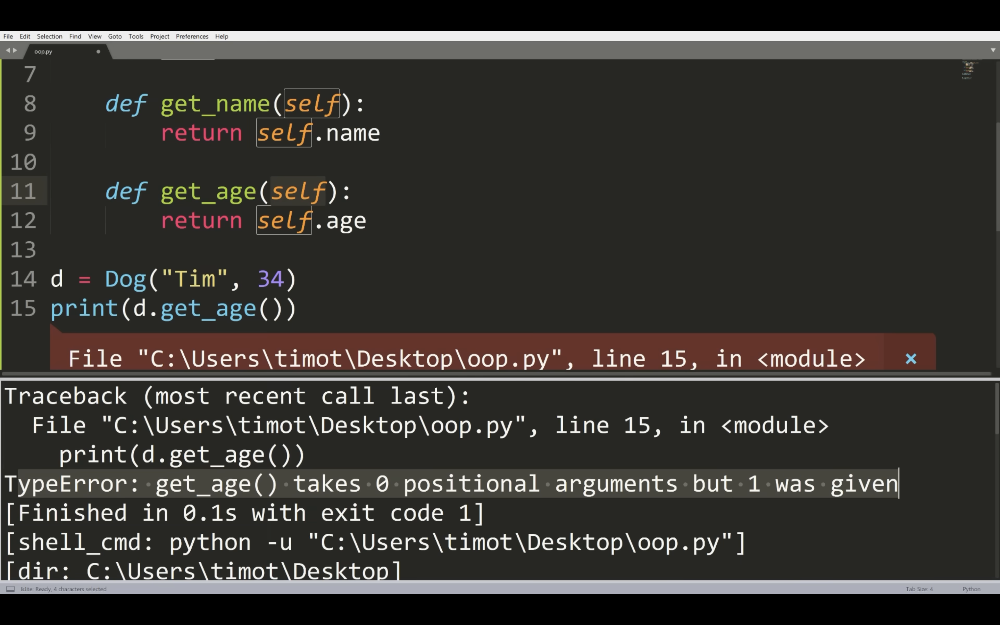
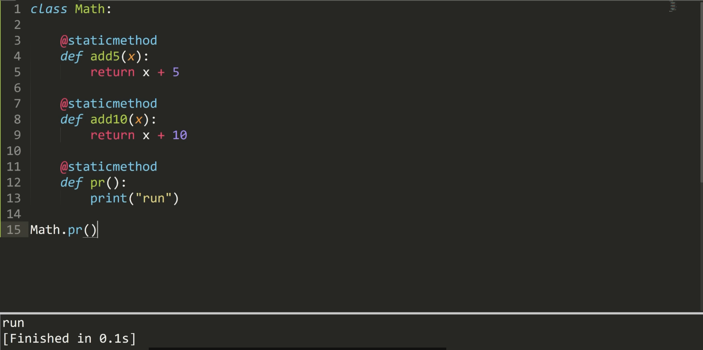

# Python-Training  
This repository is created for Python training, specifically for the submission of Python exercise files and to add summaries of the tutorial videos shared by the mentor for future reference.  

[Link To Exercise 1](Exercise1-Basics.ipynb)  

[Link To Exercise 2](Exercises2-Basics.ipynb)  

[Link To Exercise 3](Python_Practice_Exercises.ipynb)  

---

# Summary of OOP tutorial video shared by the mentor:  

## Classes and Objects  
An object is an instance of a Class.  

A Class determines the actions or interactions possible with its objects.  

All data types and variables we create are objects belonging to Classes such as `int`, `string`, etc. These Classes define what actions can be performed on their objects.  

  

Here, `Hello` is a method or function that is an object of the 'function' class.  

---

## Creating a Class  
Here, we are basically creating a blueprint for a Dog object and defining the different operations a Dog can perform.  

  

The `upper()` method, when used on an `int` data type, gives an error because the `int` class does not define any interaction (methods) named `upper` for its objects.  

---

### `__main__`  
  

Here, we created a variable `d` and assigned it an instance (object) of the `Dog` class.  

`__main__` indicates that this `Dog` class was defined in the main module.  

---

### `__init__`  
  

The `__init__` method is basically the constructor method in Python, which instantiates an object the first time it is created.  

It can be parameterized or not.  

---

## `self`  
The `self` parameter passes the actual reference to the specific object for which the class methods are called.  

  

---

## Attributes  
Attributes are variables that belong to an object/class. They store data associated with the object.  

Attributes are defined inside an instance (object) and are unique to that object.  

  

Here, the error occurred because every time an object calls a class method, it invisibly passes itself to the method as the `self` parameter, ensuring that the method operates on the correct object.  

---

## Example: How Different Classes Can Interact with Each Other  
```python
class Student:
    def __init__(self, name, age, grade):
        self.name = name
        self.age = age
        self.grade = grade  # 0 - 100

    def get_grade(self):
        return self.grade
        
class Course:
    def __init__(self, name, max_students):
        self.name = name
        self.max_students = max_students
        self.students = []

    def add_student(self, student):
        if len(self.students) < self.max_students:
            self.students.append(student)
            return True 
        return False
    
    def get_average_grade(self):
        value = 0
        for student in self.students:
            value += student.get_grade()

        return value / len(self.students)
    
s1 = Student("Tim", 19, 95)
s2 = Student("Bill", 19, 75)
s3 = Student("Gill", 19, 65)

course = Course("Science", 2)
course.add_student(s1)
course.add_student(s2)

print(course.add_student(s3))  # max_students capacity is already full
print(course.get_average_grade())
```

---

## Inheritance  
```python
class Pet:
    def __init__(self, name, age):
        self.name = name
        self.age = age

    def show(self):
        print(f"I am {self.name} and I am {self.age} years old")
    
    def speak(self):
        print("I don't know what to say")
```

---

## `super()`  
References the superclass or the parent class.  

```python
class Cat(Pet):
    def __init__(self, name, age, color):
        super().__init__(name, age)
        self.color = color 

    def speak(self):
        print("meow")

    def show(self):
        print(f"I am {self.name}, I am {self.age} years old, and I am {self.color} colored")

class Dog(Pet):
    def speak(self):
        print("bark")

p = Pet("Tim", 19)
p.speak()

c = Cat("Bill", 34, "orange")
c.show()

d = Dog("Jill", 19)
d.speak()
```

---

## Class Attributes and Methods  
These belong to a specific class and not to any object.  

```python
class Person:
    number_of_people = 0

    def __init__(self, name):
        self.name = name 
        Person.add_person()

    @classmethod
    def number_of_people_(cls):
        return cls.number_of_people  
    
    @classmethod
    def add_person(cls):
        cls.number_of_people += 1

p1 = Person("Tim")
p2 = Person("Jim") 
print(Person.number_of_people_())
```

---

## Static Methods  
A static method in Python is a method inside a class that does not depend on an instance of the class. It behaves like a regular function but belongs to the class's namespace.  

Static methods do not modify or access instance (`self`) or class (`cls`) attributes.  

  
